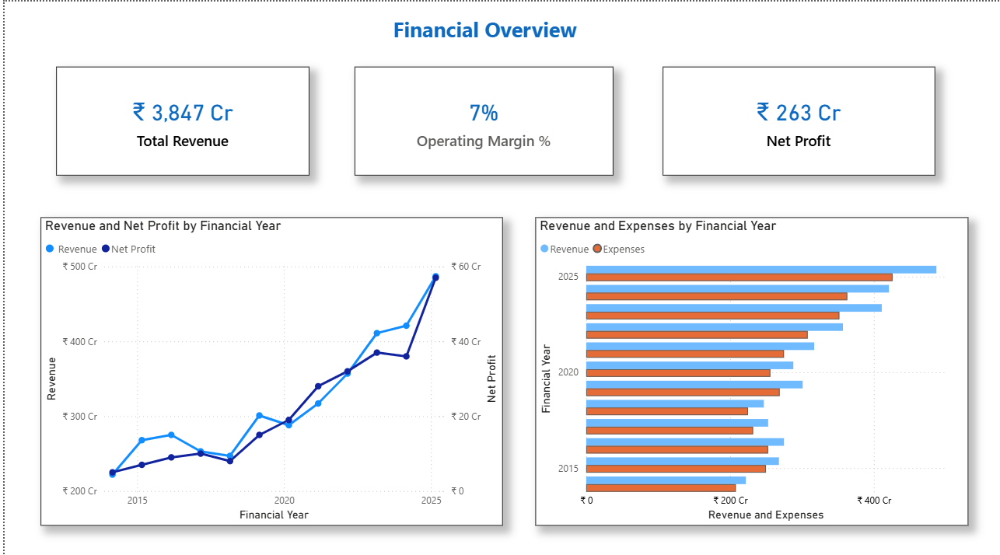
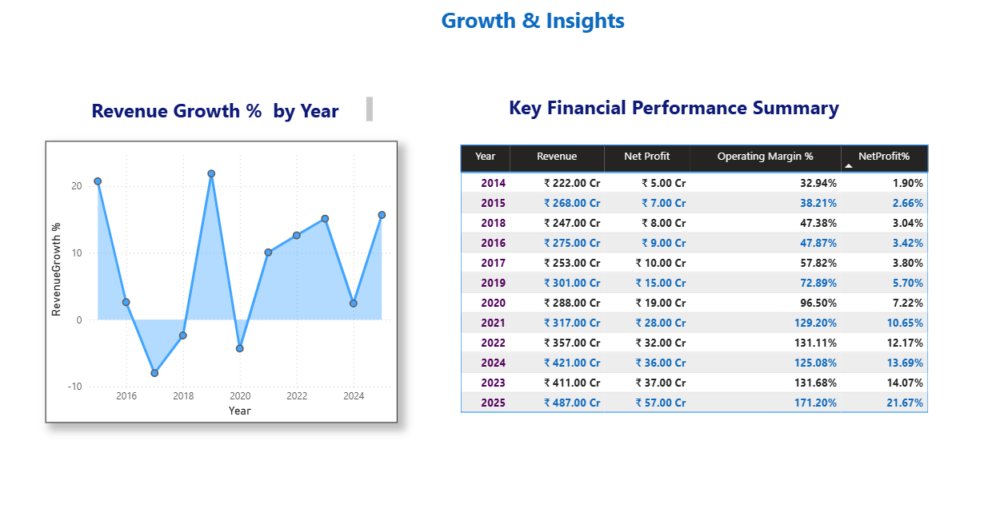
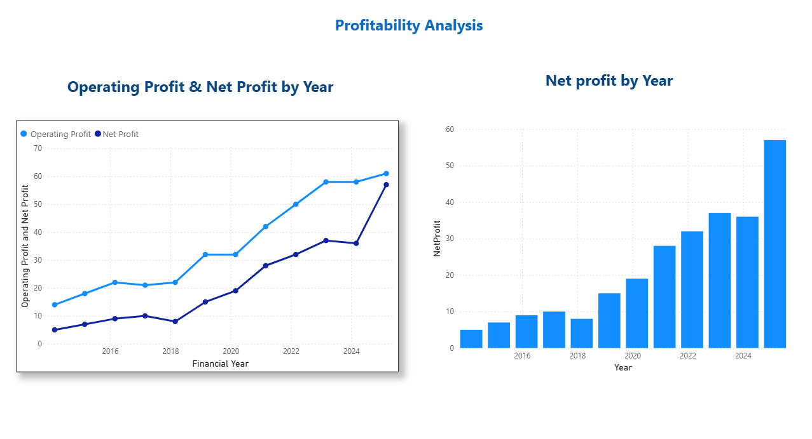

# 📊 Mallcom India – Financial Performance Analysis

## 🏢 About the Company

Mallcom (India) Ltd. is a Kolkata-headquartered manufacturer and exporter of personal protective equipment (PPE) — helmets, gloves, safety shoes, and industrial workwear — with a presence in over 55 countries. Established in 1983, the company operates 13 production facilities and holds international quality certifications including ISO, CE, and ANSI. This project analyzes its financial performance over an 11-year period (FY2014–FY2025) using publicly available financial statement data.

---

## 📌 Project Overview

This project presents a comprehensive **11-year financial performance analysis** of Mallcom (India) Ltd using historical financial statement data. The analysis evaluates revenue growth, profitability, margins, and overall financial health through an interactive Power BI dashboard.

Built from a **Financial Analyst / Business Analyst** perspective — emphasizing trend analysis, KPI tracking, and data-driven insights for decision-making.

---

## 🛠️ Tools & Technologies

| Tool | Purpose |
|------|---------|
| **Power BI** | Data modeling, DAX measures, dashboard creation |
| **Excel** | Data cleaning and financial data preparation |
| **GitHub** | Documentation and version control |

---

## ❗ Problem Statement

Investors and stakeholders often struggle to quickly assess a company's long-term financial trajectory from raw financial statements alone. Year-over-year figures scattered across multiple annual reports make it hard to spot real trends in revenue growth, margin stability, and profitability shifts.

This project consolidates **11 years of Mallcom India's financial history** into a single interactive dashboard — turning raw statement data into a clear, visual story of the company's financial evolution.

---

## 🎯 Objective

To analyze Mallcom India's historical financial statements, track revenue and profitability trends over time, identify periods of growth and decline, and present the findings through an interactive Power BI dashboard for fast, data-driven decision-making.

---

## 🧭 Methodology

**Step 1 — Data Collection**
Gathered consolidated financial statement data from Screener.in, Mallcom's Annual Reports, and public company filings — covering revenue, operating profit, net profit, and margins across 11 years (FY2014–FY2025).

**Step 2 — Data Cleaning**
Cleaned and structured the financial dataset in Excel, cross-verifying figures against annual reports to ensure accuracy and consistency.

**Step 3 — Trend Analysis**
Analyzed revenue trend, net profit growth, and year-on-year performance across the full 11-year period to identify growth and decline patterns.

**Step 4 — Profitability Analysis**
Compared operating profit vs. net profit over time and assessed margin stability and cost-management efficiency.

**Step 5 — Dashboard Development**
Built an interactive Power BI dashboard with DAX measures to visualize revenue, profit, and margin KPIs, with dedicated trend and profitability views.

**Step 6 — Insight Generation**
Translated the trends into clear takeaways on the company's growth trajectory and financial stability.

---

## 📊 Key Metrics at a Glance

| Total Revenue (FY14–FY25) | Operating Margin | Total Net Profit |
|:---:|:---:|:---:|
| **₹3,847 Cr** | **7%** | **₹263 Cr** |

| Metric | FY2014 | FY2025 |
|:---:|:---:|:---:|
| **Revenue** | ₹222 Cr | ₹487 Cr |
| **Net Profit Margin** | 1.90% | 21.67% |

> 💡 Revenue more than doubled over the analyzed period, while net profit margin grew over 11x — reflecting a major shift in operational efficiency and cost management.

---

## 🔍 Key Insights

| # | Insight |
|---|---------|
| 1 | **Steady revenue growth** across the analyzed period, from ₹222 Cr (FY14) to ₹487 Cr (FY25) |
| 2 | **Profit margins improved dramatically**, from 1.90% to 21.67%, reflecting better cost management |
| 3 | **Net profit trends** suggest improving financial stability in recent years, rising from ₹5 Cr to ₹57 Cr |
| 4 | **Operating margin** climbed from 32.94% (FY14) to over 171% (FY25) on an expanding profit base |
| 5 | **Operating vs. net profit comparison** highlights consistent margin expansion tied to operational efficiency |

---

## 🗂️ Data Sources

- **Screener.in** — consolidated income statement data (revenue, operating profit, net profit, margins)
- **Annual Reports of Mallcom (India) Ltd** — cross-verification and trend validation
- **Company Filings & Public Disclosures** — accuracy and consistency checks
- **Excel-based Financial Dataset** — prepared from the above sources as the direct Power BI input

---

## 📈 Dashboard Preview

**Financial Overview**

**Growth & Insights**

**Profitability Analysis**

**Dashboard Coverage:**
- **Financial Overview:** Total revenue, net profit, operating margin %, revenue vs. net profit trend, revenue vs. expenses by year
- **Growth & Insights:** Revenue growth % by year, full year-on-year performance summary table (revenue, net profit, operating margin, net profit margin)
- **Profitability Analysis:** Operating profit vs. net profit by year, net profit trend by year

---

## 📁 Project Files

| File | Description |
|------|-------------|
| `Mallcom_Financial_Analysis.pbit` | Power BI dashboard template |
| `mallcom_revenue.xlsx` | Financial dataset used as Power BI input |
| `mallcom_india_ltd_23.pdf` | Company financial report used for cross-verification |

> ⚠️ GitHub can't preview `.pbit` files — download it and open with **Power BI Desktop** to explore the interactive dashboard.

---

## 🎯 Purpose of the Project

- Practice real-world financial analysis using actual company data
- Demonstrate Power BI dashboard development and DAX skills
- Build a job-ready portfolio project for **Finance**, **Business Analytics**, and **Analyst** roles

---

## 👩‍💻 Author

**Sathiyavani**
[GitHub](https://github.com/sathiyavaniv)
