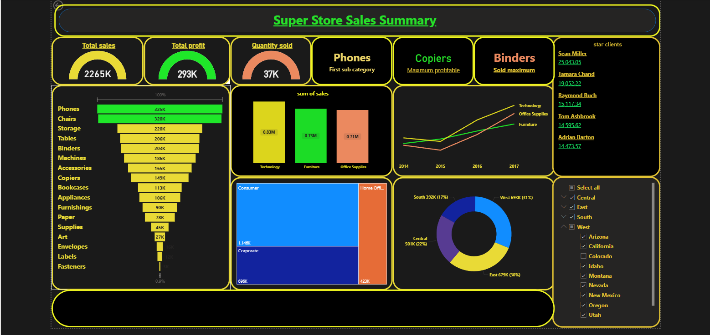

# 🛒 Superstore Sales Performance Dashboard

## 📌 Project Overview

This project analyzes sales, profit, and customer performance for a retail superstore using order-level transaction data. The dashboard tracks total sales, profit, and quantity sold across product categories, sub-categories, customer segments, and regions — highlighting top-performing products, star clients, and regional sales distribution.

Built from a **Business Analyst / Data Analyst** perspective — emphasizing category performance, customer value, and regional sales trends for decision-making.

---

## 🛠️ Tools & Technologies

| Tool | Purpose |
|------|---------|
| **Excel** | Data cleaning and preparation of order-level data |
| **Power BI** | Data modeling, DAX measures, dashboard creation |

---

## ❗ Problem Statement

A retail superstore generates thousands of orders across multiple product categories, customer segments, and regions — but without a consolidated view, it's difficult to identify which products drive the most profit, which customers generate the most value, and which regions are under- or over-performing.

This project consolidates order-level sales data into a single interactive dashboard, making it possible to quickly identify top sub-categories, most profitable product lines, and regional sales distribution at a glance.

---

## 🎯 Objective

To analyze sales and profit performance across product categories, sub-categories, customer segments, and regions, identify top-performing products and customers, and present the findings through an interactive Power BI dashboard.

---

## 🧭 Methodology

**Step 1 — Data Collection**
Used order-level transaction data (Orders, Returns, and People) covering sales, profit, quantity, discount, customer, product, and location details.

**Step 2 — Data Cleaning**
Cleaned and prepared the dataset in Excel — verified data types (dates, numeric fields), checked for missing values, and structured the data for Power BI import.

**Step 3 — Category & Sub-Category Analysis**
Analyzed sales performance across product categories (Technology, Furniture, Office Supplies) and ranked sub-categories by total sales using a funnel view.

**Step 4 — Customer & Segment Analysis**
Identified star clients by total sales value and analyzed sales split across Consumer, Corporate, and Home Office segments.

**Step 5 — Regional Analysis**
Compared sales distribution across West, East, Central, and South regions, with drill-down filtering by state.

**Step 6 — Dashboard Development**
Built an interactive Power BI dashboard with KPI cards, a sales trend line by category and year, a sub-category funnel, a customer segment treemap, and a regional donut chart.

---

## 📊 Key Metrics at a Glance

| Total Sales | Total Profit | Quantity Sold |
|:---:|:---:|:---:|
| **2,265K** | **293K** | **37K** |

| Category | Highlight |
|---|---|
| 📱 **Phones** | First sub-category by total sales |
| 🖨️ **Copiers** | Most profitable sub-category |
| 📎 **Binders** | Highest quantity sold |

---

## 🔍 Key Insights

| # | Insight |
|---|---------|
| 1 | **Phones and Chairs lead all sub-categories** in total sales (325K and 320K respectively), with a long tail of lower-volume sub-categories like Fasteners and Labels |
| 2 | **Technology is the top-selling category** (0.83M), ahead of Furniture (0.73M) and Office Supplies (0.71M) |
| 3 | **Technology sales grew the fastest** from 2014–2017, overtaking both Furniture and Office Supplies by 2017 |
| 4 | **Consumer segment dominates**, generating 1,146K in sales versus 696K from Corporate and 423K from Home Office |
| 5 | **The West region leads sales** at 693K (31%), followed by East (679K, 30%), Central (501K, 22%), and South (392K, 17%) |
| 6 | **A small group of star clients** — led by Sean Miller (25,043.05) — contribute disproportionately to total sales |

---

## ✅ Recommendations

1. **Double down on Technology** — it's the top-selling and fastest-growing category (0.83M in sales, overtaking Furniture and Office Supplies by 2017). Prioritize inventory and marketing spend here.
2. **Push Copiers as a margin driver** — since it's the most profitable sub-category despite not leading in volume, bundling or upselling copiers alongside Phones (the top seller) could lift overall margin.
3. **Re-evaluate low-performing sub-categories** — Fasteners, Labels, and Envelopes sit far below the rest of the funnel (under 20K each). Consider reducing SKU count or repositioning these as bundled add-ons rather than standalone listings.
4. **Build a retention program for star clients** — a small group of customers (led by Sean Miller at 25,043.05) drive disproportionate revenue. A dedicated account management or loyalty tier for top clients protects this concentrated revenue base.
5. **Grow the Corporate and Home Office segments** — Consumer sales (1,146K) dwarf Corporate (696K) and Home Office (423K). Targeted B2B outreach or bulk-order incentives could unlock growth in these underrepresented segments.
6. **Investigate the South region's underperformance** — South trails all other regions at 392K (17%), well behind the West (693K, 31%). Region-specific promotions or a review of distribution/service gaps in the South could help close this gap.

---

## 🗂️ Data Source

Order-level retail transaction dataset (Superstore dataset) — Orders, Returns, and People sheets, covering sales, profit, quantity, discount, customer, product, and regional details.

---

## 📈 Dashboard Preview

**Dashboard Coverage:**
- **KPI Overview:** Total sales, total profit, quantity sold, top sub-category, most profitable sub-category, highest quantity sold
- **Category Performance:** Sub-category sales funnel, sum of sales by category, sales trend by category and year
- **Customer & Segment Analysis:** Star clients leaderboard, sales split by Consumer/Corporate/Home Office
- **Regional Analysis:** Sales distribution donut chart by region, with state-level filtering

---

## 📁 Project Files

| File | Description |
|------|-------------|
| `sales_dashboard.pbix` | Power BI dashboard file |
| `OrdersV2.xlsx` | Order-level dataset (Orders, Returns, People) |

> ⚠️ GitHub can't preview `.pbix` files — download it and open with **Power BI Desktop** to explore the interactive dashboard.

---

## 🎯 Purpose of the Project

- Practice real-world retail sales and profitability analysis
- Demonstrate Power BI dashboard development and DAX skills
- Build a job-ready portfolio project for **Data Analyst** and **Business Analyst** roles

---

## 👩‍💻 Author

**Sathiyavani**
[GitHub](https://github.com/sathiyavaniv)
