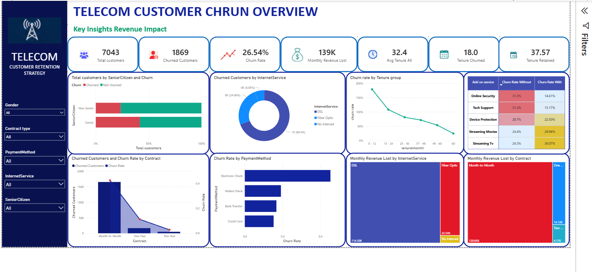

# 📡 Telecom Customer Churn & Revenue Risk Analysis

## 📌 Project Overview

This project analyzes customer churn for a telecom company using real-world subscriber data to uncover **who is churning, why they are churning, and how much revenue is at risk**. The analysis identifies key churn drivers across contract type, payment method, internet service, and add-on subscriptions, then translates those drivers into ROI-quantified retention recommendations.

Built from a **Data Analyst / Business Analyst** perspective — emphasizing segmentation, root-cause analysis, and data-driven decision-making.

---

## 🛠️ Tools & Technologies

| Tool | Purpose |
|------|---------|
| **Python & SQL (MySQL)** | Data cleaning, EDA, churn metric calculations |
| **VS Code** | Writing and organizing scripts |
| **Power BI** | Data modeling, DAX measures, dashboard creation |
| **Excel** | Data preparation and validation |

---

## ❗ Problem Statement

Customer churn was causing significant revenue loss for the business. Acquiring a new customer costs more than retaining an existing one, so unmanaged churn directly erodes profitability, recurring revenue, and customer lifetime value — while giving competitors an opening to capture lost customers.

In this dataset of **7,043 real telecom customers**, **1,869 churned** — a **26.54% churn rate** — representing **$139,131 in monthly recurring revenue** at risk, or **over $1.67 million annually**.

The core problem wasn't just that customers were leaving — it's that the business had no early warning system, no segment-level understanding of churn, and no data-backed retention strategy.

---

## 🎯 Objective

To analyze customer data, identify high-risk customer segments, understand the root causes of churn, calculate the revenue impact, and deliver data-driven recommendations to reduce churn and protect recurring revenue.

---

## 🧭 Methodology

**Step 1 — Data Collection**
Used a telecom customer dataset containing 7,043 customer records with 21 variables.

**Step 2 — Data Cleaning**
Cleaned the data using Python and SQL — checked for missing values (missing Total Charges, blank customer fields), removed duplicate records, corrected inconsistent data formats, and prepared the dataset for analysis.

**Step 3 — Exploratory Data Analysis (EDA)**
Analyzed customer behavior using Python and SQL across gender, senior citizen status, partner/dependents, contract type, internet service, payment method, monthly charges, total charges, and tenure to identify which factors correlated with churn.

**Step 4 — Revenue Analysis**
Calculated the revenue generated by churned customers and estimated ongoing revenue at risk if similar customers continued leaving.

**Step 5 — Dashboard Development**
Built an interactive Power BI dashboard with filters and KPIs to visualize churn rate, revenue at risk, contract distribution, payment methods, tenure, and customer demographics.

**Step 6 — Business Recommendations**
Translated the findings into targeted customer retention strategies for the highest-risk segments.

---

## 📊 Key Metrics at a Glance

| Total Customers | Customers Churned | Churn Rate | Monthly Revenue at Risk |
|:---:|:---:|:---:|:---:|
| **7,043** | **1,869** | **26.54%** | **$139,131** |

---

## 🔍 Key Insights

| # | Insight | Why It Matters |
|---|---------|-----------------|
| 1 | **Month-to-month contract customers churn the most** (42.7%) | Easy to cancel anytime — no lock-in |
| 2 | **Electronic check users churn more** (45.3%) | May signal lower engagement or satisfaction |
| 3 | **New customers (low tenure) churn more** | Haven't yet built long-term loyalty |
| 4 | **Higher monthly charges correlate with churn** | Customers may switch to cheaper competitors |
| 5 | **Fiber optic customers churn at 41.9%** despite being premium payers | Price-to-value mismatch or service issues |
| 6 | **Customers without security/tech support add-ons churn at ~41.7%** | Lack of added stickiness/value |
| 7 | **Senior citizens churn at 41.7%** vs. 23.6% for non-seniors | May need different engagement approach |
| 8 | **Overall churn rate: ~26.5%**, representing significant revenue at risk | Confirms scale of the problem |

> 💡 88.5% of all churned customers were on month-to-month contracts. Churned customers stayed an average of **18 months**, vs. **37.6 months** for retained customers.

---

## 🗂️ Data Source

**IBM Telco Customer Churn dataset** — 7,043 customers, 21 variables
Source: Kaggle / IBM Watson Analytics

---

## 📈 Dashboard Preview

**Dashboard Coverage:**
- **Overview:** Total customers, churned customers, churn rate, monthly revenue lost, average tenure
- **Churn by Segment:** Contract type, payment method, internet service, senior citizen status, tenure group, add-on services
- **Revenue Impact:** Monthly revenue lost by internet service type and by contract type

---

## ✅ Recommendations

1. **Contract conversion** — Offer discounts to month-to-month customers to encourage a move to annual contracts
2. **Early retention campaigns** — Target new customers during their first six months, before loyalty forms
3. **Personalized offers** — Identify high-value, high-risk customers and offer tailored retention deals
4. **Service quality improvements** — Prioritize customers with frequent complaints or service issues
5. **Bundled packages** — Offer Internet + TV + Phone bundles to increase customer stickiness
6. **Continuous monitoring** — Track high-risk segments regularly via the Power BI dashboard so the business can act before customers leave

---

## 📁 Project Files

| File | Description |
|------|-------------|
| `Telecom_Churn_Analysis.pbix` | Power BI dashboard file |
| `Telco_Customer_Churn.csv` | Raw dataset |
| `customer_churn_analysis_project.ipynb` | Python notebook — data cleaning, EDA, and churn analysis |
| `churn_queries.sql` | SQL scripts used for cleaning & metrics |

> ⚠️ GitHub can't preview `.pbix` files — download it and open with **Power BI Desktop** to explore the interactive dashboard.

---

## 🎯 Purpose of the Project

- Practice real-world churn and revenue-risk analysis using actual customer data
- Demonstrate SQL, Python, and Power BI dashboard development skills
- Build a job-ready portfolio project for **Data Analyst** and **Business Analyst** roles

---

## 👩‍💻 Author

**Sathiyavani**
[GitHub](https://github.com/sathiyavaniv)

